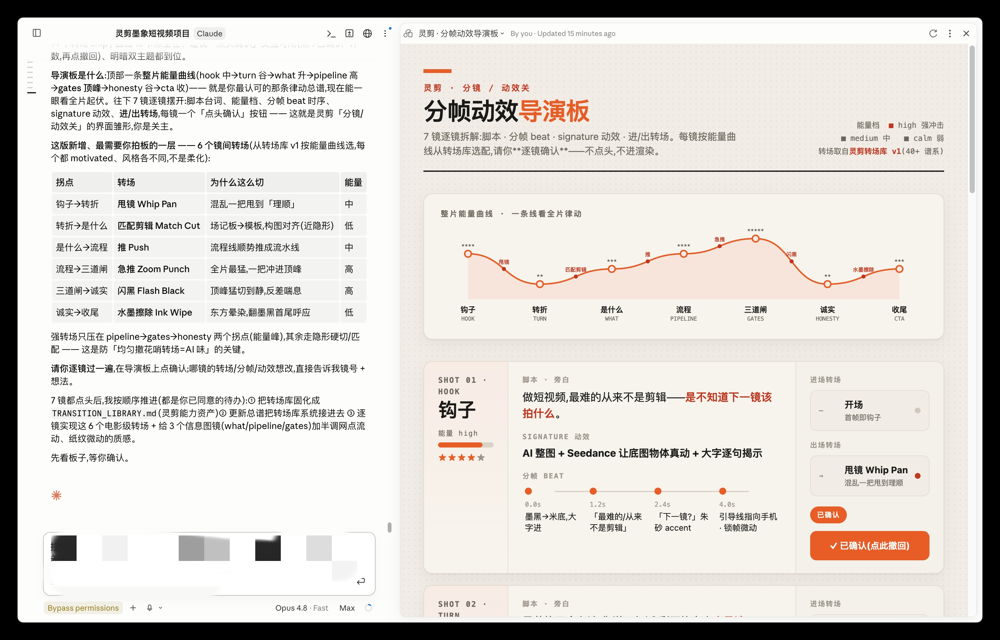
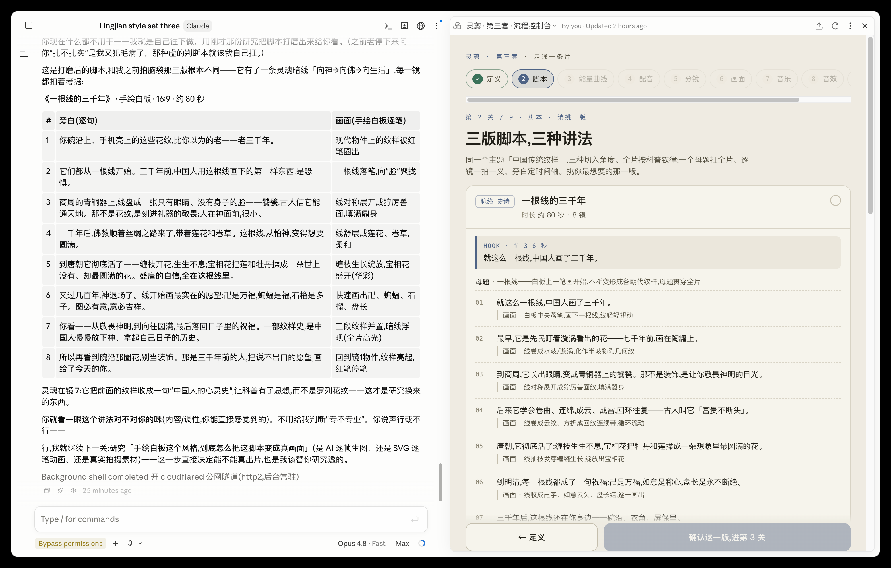
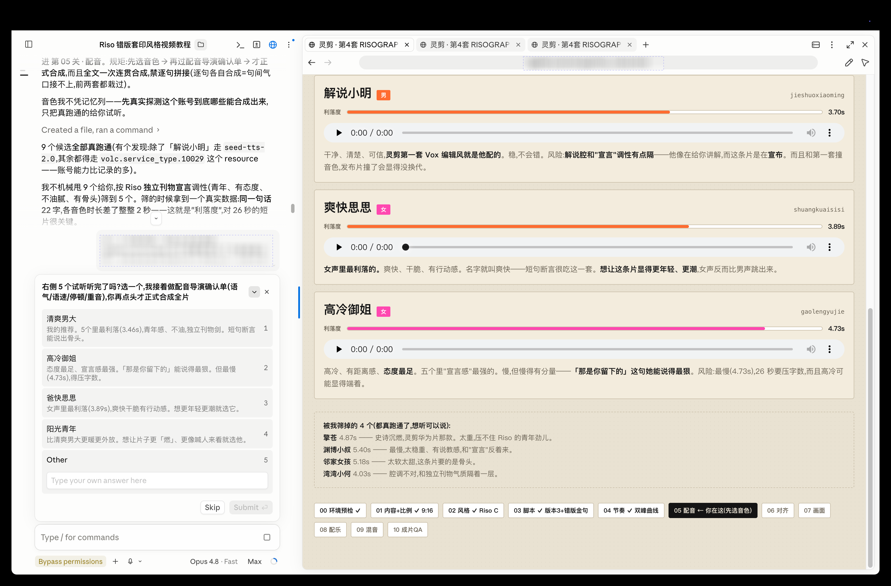
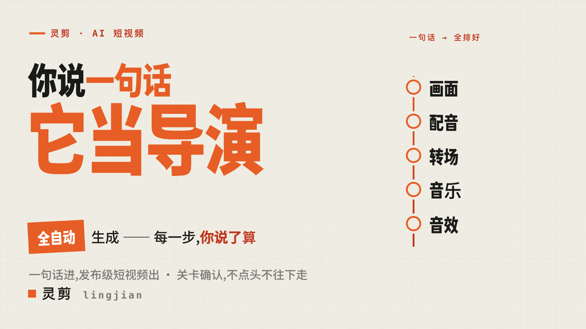
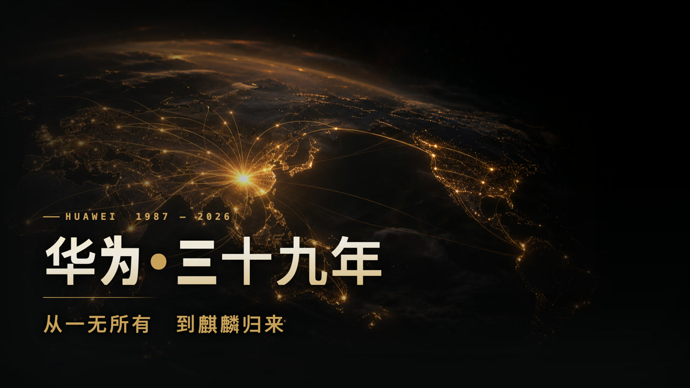
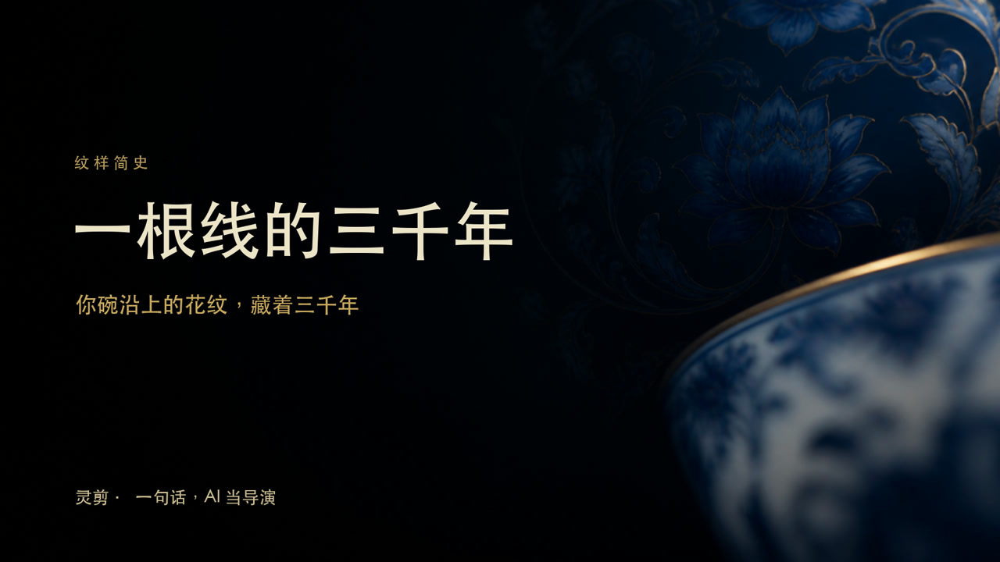
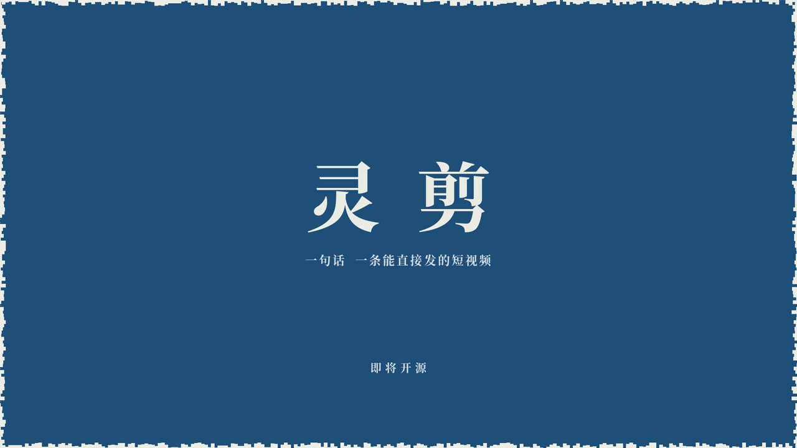

# lingjian-video (灵剪)

[中文](README.md) · **English**

[](LICENSE)   

> One sentence in — script / storyboard / voiceover / visuals / music / subtitles / SFX, all automatic. **But every gate is auditable.**

<div align="center">
  <video src="https://github.com/user-attachments/assets/8627e492-e0ff-41dd-8466-aff1e0a00801" controls playsinline width="82%"></video>
</div>

> **▶ lingjian · open-source intro · 16:9** — play it in the embedded player above (desktop/mobile web). Produced end-to-end by lingjian.
>
> 📱 The GitHub mobile app doesn't render embedded video — open the [online gallery](https://dososo.github.io/blcaptain-lingjian-video/docs/gallery.html) to watch all four styles.

---

## Why

AI "one-sentence video" tools are a black box: one sentence in, one clip out. Shot three is off and you want to fix just that one — you can't; you can only regenerate the whole thing and hope the next take is better.

**lingjian works the other way**: one sentence goes in, and script → storyboard → voiceover → visuals → music → subtitles → SFX all run automatically — **but every gate stops and shows you its candidates, and only proceeds when you nod.** You're not rolling dice; you're deciding, gate by gate.

> Honest premise: lingjian only guarantees a **reproducible, gate-by-gate auditable** process. It does not promise finished-video quality or "going viral."

---

## What makes it different · five design pillars

Drop any one and lingjian degrades into just another black box.

1. **Blueprint first** — the whole film is governed by one blueprint (energy curve + visual motif + each gate's artifact and gate check), not shot-by-shot free-for-all. (Auto-generating the energy curve from pipeline artifacts is being wired into the main line — see Roadmap.)
2. **Local director console** — every gate opens a readable, interactive director board **on your own machine (`localhost`)**, laying out this gate's candidates shot by shot. **Never a cloud or dev URL** — every step you see runs on your own computer.
3. **Research throughout** — research isn't a one-time opener; every gate keeps absorbing top-tier evidence, internalizing it as a baseline, and steering the output.
4. **Gate confirmation — candidates, not yes/no** — each gate doesn't ask "is this OK?"; it offers candidates for you to pick and edit, and only advances when you nod.
5. **Auditable** — every gate's artifact, gate check, and evidence are traceable. Approvals are signed and bound to artifact content — **change the content, the approval auto-invalidates.**

### ▸ lingjian in action · the director console

At every gate the console lays the candidates out for you, shot by shot; you approve gate by gate before it moves on — here are the real **storyboard/motion gate**, **script gate**, and **voice gate** screens.

<div align="center">
  
  <br><sub><b>Storyboard/motion gate</b> — one whole-film energy curve for the rhythm, 7 shots broken down (script · frame beats · signature motion · in/out transitions); approve each shot before it renders</sub>
</div>

<br>

<div align="center">
  
  <br><sub><b>Script gate</b> — same topic, three drafts / three angles, laid out shot by shot; pick the one you want</sub>
</div>

<br>

<div align="center">
  
  <br><sub><b>Voice gate</b> — real-synthesis voice auditions you can play one by one, with the 11-step flow auditable at every gate</sub>
</div>

---

## Four styles (one capability set, reskinned — not rebuilt)

> All four are produced by lingjian. Click any poster to play in the [online gallery](https://dososo.github.io/blcaptain-lingjian-video/docs/gallery.html).

<table>
<tr>
<td width="50%"><a href="https://dososo.github.io/blcaptain-lingjian-video/docs/gallery.html"></a><br><b>① VOX · Clean Tech</b> (9:16 + 16:9) — bright, direct; the home turf for product intros.</td>
<td width="50%"><a href="https://dososo.github.io/blcaptain-lingjian-video/docs/gallery.html"></a><br><b>② DARK KEYNOTE · Dark Epic</b> (16:9) — heavy, keynote-launch gravity.</td>
</tr>
<tr>
<td><a href="https://dososo.github.io/blcaptain-lingjian-video/docs/gallery.html"></a><br><b>③ CINEMATIC · Cinematic Essay</b> (16:9) — "Three Thousand Years of One Thread," a single golden line threading the narrative.</td>
<td><a href="https://dososo.github.io/blcaptain-lingjian-video/docs/gallery.html"></a><br><b>④ NEUE SACHLICHKEIT · Documentary Objectivity</b> (16:9) — hands + real objects + one real physical phenomenon carrying the whole film, no voiceover.</td>
</tr>
</table>

---

## Production flow (one sentence → finished film, auditable at every gate)

You just talk like a human; the complexity stays in the back. The main line:

| Gate | You do | lingjian does | Stops for your review |
|---|---|---|---|
| **0 · Set the goal** | Say it: platform, topic, aspect ratio, which source content | Restate as a clear production goal | — |
| **0 · Capability check** | Glance at "have / need" | Detect local capabilities; plainly tell you how to fill gaps | — |
| **1 · Script** | Read it, say "approve" or edit | Write from your source content; won't invent product facts | ⏸ review script |
| **2 · Voiceover** | Audition voices, pick one → confirm tone → approve | Real auditions, a director sheet, one continuous take | ⏸ review voice |
| **3 · Visuals** | Per shot, see "what you'll see, how it moves, how it cuts"; nod or add assets | A per-shot director sheet, shown in the local console | ⏸ review visuals |
| **4 · Subtitles / Music / SFX** | Audition BGM, pick the mood | Burn verbatim subtitles, bed BGM, place SFX on the beat | with the visuals gate |
| **5 · Render / QA / Export** | Take the film | FFmpeg render, strict QA that blocks sample-grade fakes, multi-platform export | release QA all-green before export |

**Three human approval gates**: script / voice / visuals — all must be approved before render. Approvals are signed and bound to artifact content; **edit the content and the approval auto-invalidates** (no `--force`).

The CLI is the execution engine; regular users don't type it:

```bash
uv run lj run ./projects/demo --name "Demo" --input-file examples/product_intro_zh.txt --json
# Stops automatically at the script / voice / visuals gates; approve to continue.
```

---

## Toolchain & division of labor (honest tiers)

lingjian's core is an **agent-agnostic orchestrator + FFmpeg assembler + auditable gates**. Tools fall into three tiers by how they plug in; `doctor` honestly tells you which are "ready / missing":

**① Built into lingjian (its own code)**
- Orchestration / state machine / three approval gates (signed, bound to artifacts, auto-invalidate on edit)
- **FFmpeg / ffprobe** rendering (H.264 + burned-in CJK subtitles + AAC + loudness normalization), QA hard gates, multi-platform export + license manifest
- **Seedance text-to-video (publish-grade)**: when a Volcengine ARK key is present, the visuals gate **calls Seedance directly** from the shot prompts to generate real motion-video mp4 (`--engine seedance`) — the core of "one sentence → real video" for zero-asset users, not a hand-off to the user
- **Whisper word-level alignment**: after voiceover synthesis, transcribes the audio into real-timeline subtitles (replaces character-count estimation)
- **silencedetect beat points**: measures voiceover pauses → speech-segment starts; visual events land on these points, never ahead of the voiceover
- Provider detection & bridging, CJK font handling

**② Host / CLI plug-and-play (lingjian detects & consumes outputs; no bundled SDK)**
- **LLM**: inherits your logged-in `claude` / `codex` CLI, or `ollama` / OpenAI-compatible
- **TTS**: user recording (preferred, publish-grade), or **Volcengine Doubao** (the sole publish-grade cloud TTS); local Kokoro is preview-only when no key is set
- **Dynamic visuals**: host HyperFrames (publish-grade) / Remotion / your own per-shot mp4
- **AI image-gen**: Codex's built-in image generation; other agents (Claude / Gemini / Cursor) call Codex's image-gen via `codex exec` (lingjian consumes the images; reference-grade only)
- **Music / SFX**: royalty-free BGM/SFX fetched from Pixabay by the host agent's browser tools (Chrome use / computer use — Pixabay has no public music API), or user-supplied; attached via `lj ingest audio --kind bgm/sfx` and auto-mixed (BGM 16dB below voice by default)
- **Web screenshots**: Playwright (`ingest url --screenshot`)

**③ Capability library · shipped with the repo (`capabilities/` + `director-board/`)**
- **director-board** (the gate-confirmation flagship) · **transition library** (42-transition atlas + content matcher, scarcity guard reproducible via `node` test) · **cadence** (silencedetect precise beats) · **SFX strategy** (action→SFX mapping, five iron rules) · **layout safety** (glyph-overflow guard) — cross-cutting capabilities reusable across every aspect ratio and style; the differentiator a "one-line-to-video" tool can't match. Index: [`capabilities/README.md`](capabilities/README.md).

**④ Structural items · integrating (see Roadmap)**
- Whole-film energy-curve auto-generation · rhythm gate · research-evidence gate · style / music candidate gates · multi-version scripts — the **process-gate** completion of the core differentiators, validated across the four demo films and being wired into the main line.

### Which agents can use it

- **Agent-agnostic**: `lj` is a plain CLI — any agent (or human) that can run shell commands can drive it. That's the real basis for "multi-agent."
- **First-class packaging**: Claude Code installs via the `scripts/install_skill_links.sh` symlink; Codex installs via the plugin marketplace.
- **Other agents (Gemini / Cursor, etc.)**: usable today via the `lj` CLI; dedicated packaging is on the Roadmap.

---

## Install

lingjian is **agent-agnostic** — any agent (or human) that can run shell commands can drive it.

**Easiest (recommended) · conversational** — send this repo to your AI agent and let it install and run the capability check:

- **Claude Code**: tell it "install the skill at `https://github.com/dososo/blcaptain-lingjian-video`"
- **Codex app**: `codex plugin marketplace add dososo/blcaptain-lingjian-video`

**Manual · local**:

```bash
git clone https://github.com/dososo/blcaptain-lingjian-video && cd blcaptain-lingjian-video
uv sync
scripts/install_skill_links.sh   # symlink into ~/.claude/skills and ~/.agents/skills
uv run lj setup                  # capability check: inherited / ready / must-fill / optional
```

Other agents (Gemini / Cursor, etc.) drive it the same way via the `lj` CLI.

**FFmpeg is a release hard gate**, and must support `drawtext` and AAC:

```bash
# macOS
brew install ffmpeg && ffmpeg -filters | grep drawtext
# Ubuntu/Debian
sudo apt-get install -y ffmpeg && ffmpeg -filters | grep drawtext
# Windows
winget install Gyan.FFmpeg
```

Voiceover, real providers, and secure key setup (incl. Volcengine): see [`docs/ONBOARDING.md`](docs/ONBOARDING.md) and [`docs/CAPABILITY_MATRIX.md`](docs/CAPABILITY_MATRIX.md). **Keys are read only from the environment — never written to the repo, logs, or export packages.**

---

## Local director console (director-board)

lingjian's gate console is a **data-driven local director board**, shipped with the repo (`director-board/`). **One command starts a local server and lays out the current gate's candidates automatically:**

```bash
uv run lj console ./projects/demo --json
# prints http://127.0.0.1:<port>/ — open it in a browser; that's the gate console
```

- **Auto-builds the candidate page for the current gate**: **voice gate** = voice cards + inline audition players; **script / storyboard gate** = the energy-curve director board (per-shot lines, beat timing, signature motion, in/out transitions, and a "confirm" button).
- **Binds `127.0.0.1` only, never public**; confirmations write back to `artifacts/console_state.json`. Vanilla JS + SVG, no third-party libs, no network requests (beyond local data), reproducible.
- You can also start the static server manually: `cd director-board && python3 -m http.server 8080`, open `standalone.html` (sample storyboard).
- In progress (see Roadmap): a dedicated visual-gate (`visual_plan`) view, confirmations auto-promoting to `lj approve`, and `lj run` invoking the console at each gate.

---

## Privacy & security

- **Data stays local by default**: project files, artifacts, renders, and export packages are written to your local directory.
- **Keys don't hit disk by default**: real provider keys are read only from the current shell environment — not the repo, logs, manifest, or release package.
- **Inherit before asking for a key**: logged-in Claude / Codex CLIs are invoked only via their official commands — no tokens, cookies, or Keychain internals are read.
- **Console is local-only**: the director board makes no external requests, embeds no remote resources, and uses no cloud or dev URL.

---

## Roadmap

- **Structural completion** (in progress): whole-film energy-curve auto-generation, rhythm gate, research-evidence gate, style / music candidate gates, multi-version scripts (Seedance text-to-video, Whisper alignment, silencedetect beat points, the transition library + matcher, cadence, SFX strategy, and layout safety all ship with the repo).
- **`lj console` deepening**: a dedicated visual-gate (`visual_plan`) view, confirmations auto-promoting to `lj approve`, and `lj run` invoking the console at each gate (the base `lj console` — local server, auto-built per-gate candidate page, write-back — shipped in **v1.1.0**).
- **More agent packaging**: dedicated install for Gemini, Cursor, etc.
- **MCP server**: let host agents call the main-line tools via MCP.
- **Platform knowledge packs**: publish structures and subtitle templates for Douyin / Xiaohongshu / Bilibili / YouTube.
- **More styles** (reskin expansions on the same capability set — planned from a 16-style atlas, 4 shipped): DUOTONE · RISOGRAPH · POP ART · INK WASH · PAPER CUT · SWISS GRID · ISO 3D · DATA STREAM · WHITEBOARD · EDITORIAL · ZEN · LETTERPRESS.

---

## FAQ

**Does lingjian guarantee viral hits?** No. It only guarantees a reproducible, gate-by-gate auditable process. Quality verdicts come from real commands, render manifests, ffprobe, and QA hard gates — never LLM self-assessment.

**Can I use it without a key?** For preview: inherited LLM for the script + local sample TTS + local FFmpeg. Publish-grade needs real voiceover (recording or cloud TTS) and real motion visuals.

**Will it silently call paid services?** No. Paid capabilities (e.g., Volcengine) state the account/cost premise first and run only after your confirmation.

---

## About the author

**lingjian-video (灵剪)** is independently built and maintained by **BLCaptain (爆裂队长NEXT)** — an open-source Agent Skill that turns "one sentence → an auditable short video" into a reproducible, auditable, archivable process.

- GitHub: [@dososo](https://github.com/dososo)
- X / Twitter: [@thinkszyg](https://x.com/thinkszyg)
- Email: blteam2026@outlook.com

Feedback and requests welcome in [Issues](https://github.com/dososo/blcaptain-lingjian-video/issues). If this project helps you, a Star is appreciated.

---

## License

This repository is licensed under **Apache License 2.0** — see [LICENSE](LICENSE).

Third-party tools, models, and fonts are governed by their own terms; verify the licensing of the TTS / video-generation / stock / font assets you use before any commercial release.
