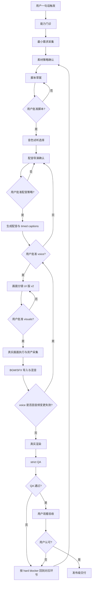

# 灵剪 Skill 首次安装到发布级出片全流程

本文档面向第一次使用灵剪的普通用户、产品设计者和交付执行者,说明用户从下载 Skill 到拿到可发布视频时,每一步应该看到什么、确认什么,以及 Codex/灵剪在后台做什么。

核心原则:灵剪不是“输入一句话就直接宣称发布级出片”的黑盒,而是“从一句话开始,逐步完成能力门诊、需求采集、三审确认、真实素材执行、渲染、QA 和人工观看验收”的导演系统。没有通过 `--release --strict` 和用户观看认可之前,只能说完成了某个阶段,不能说发布级闭环完成。

## 1. 用户入口

用户安装 Skill 后,第一步不需要理解 CLI、provider、manifest、ffmpeg 或环境变量。

推荐用户只说一句话:

```text
我想做一条视频,主题是:灵剪 Skill 是什么。
```

Codex 的责任:

- 识别这是灵剪短视频主线。
- 不直接生成完整视频。
- 先进入能力门诊和需求采集。
- 每次只让用户完成一个最短动作。

不能做:

- 不能一上来甩出大段 JSON、环境变量或 provider 矩阵。
- 不能默认用户已经具备发布级配音、真实画面、BGM/SFX 和素材授权。
- 不能把预览样片、静态图、模板动效说成发布级成片。

## 2. 第一次能力门诊

安装后先检查当前机器和 Codex 宿主具备什么能力。

内部命令:

```bash
uv run lj doctor --json
```

用户面展示应该翻译成四类:

- 已继承:例如 Codex/Claude CLI、已有 FFmpeg、已有 HyperFrames 检测结果。
- 已具备:当前是否能写脚本、生成配音、渲染视频、做动态图形。
- 必须补齐:发布级 TTS、真实动态画面、BGM/SFX、Remotion opt-in 宿主等。
- 当前只能做什么:预览档、候选样片、还是可以进入发布档。

输出口径:

```text
我先检查你本机能不能做发布级视频。当前可以写脚本和做预览,但发布级还缺真实配音/真实动态画面/BGM 等能力。下一步先补一个最短缺口。
```

不能做:

- `doctor` 没 ready 时不能继续 release。
- 只检测到 Kokoro/Piper/say/espeak-ng 时,不能说已有发布级中文配音。
- 只检测到 imagegen、静态图或 fallback card 时,不能说已有发布级画面。
- Remotion 只能 opt-in,未确认 license 和宿主入口前不能进入 strict 发布。

## 3. 最小需求采集

Codex 必须先把视频目标问清楚。用户已经给齐时,直接复述确认;没给齐时,一次只问最关键的一项。

必须确认:

```text
平台:抖音 / 小红书 / B站 / 视频号 / YouTube 等。
画幅:9:16 / 16:9 / 3:4 / 4:3 / 1:1。
主题:这条视频讲什么。
内容依据:README、Skill 说明、网页、GitHub 仓库、文档、PDF、PPT、已有文案等。
目标用户:给谁看。
看完动作:理解、关注、咨询、下单、下载、试用等。
现有素材:有没有截图、录屏、图片、视频、音频。
口播音频:有没有用户录好的音频。
```

用户面示例:

```text
我先确认制作目标:
平台是抖音/小红书,画幅是 16:9,主题是“灵剪 Skill 是什么”,内容依据是当前 README 和 Skill 说明,希望观众知道灵剪可以从一句话走完整视频流程,当前没有视频素材,也没有录好的口播。
```

不能做:

- 用户只给平台时,不能静默决定画幅。
- 用户只给主题时,不能凭模型常识编完整脚本。
- 用户没有素材时,不能直接宣称能做发布级真实画面。

## 4. 素材策略确认

素材策略必须在脚本和画面执行前说清楚。

素材优先级:

1. 用户提供的真实视频、录屏、产品画面。
2. Codex 经用户授权采集的目标对象截图/录屏。
3. HyperFrames 真实动态合成。
4. Remotion opt-in 精密程序化视频。
5. 合规公开图库或用户授权图片,经过抠图、遮罩、描边、透明化、构图处理后作为素材。
6. 生成图或静态图只作为参考,不能冒充发布级动态视频。

用户没有截图或视频素材时,可以问:

```text
你现在没有视频素材。接下来有三种选择:
1. 你提供截图/录屏;
2. 你授权我采集当前项目 README、Skill、CLI、QA、导出包等目标对象素材;
3. 不采集真实界面,改用动态图形解释。
```

公开图库策略:

- 只有在用户没有提供素材、且画面确实需要图片时才使用。
- 先征询用户是否允许使用公开免费图库。
- 国内外公开源都必须记录来源与 license。
- 图片需要按画面关系处理:透明背景、描边、遮罩、裁切、色调统一、主体/字幕避让。
- 图片素材不能直接等同发布级动态视频,必须进入动态合成或明确标为参考。

录屏策略:

- 涉及当前屏幕时必须先问:

```text
杰哥,当前屏幕是否无隐私内容,可以录屏?
```

- 没有明确授权,不能录屏。
- 用户不想录屏时,给手动导入 mp4 的 fallback。

## 5. 脚本草案与脚本审批

脚本阶段目标是确认“这条片到底说什么”。

Codex 输出给用户:

- 视频定位。
- 预计时长。
- 镜头数量和节奏,镜头数由内容决定,不是固定 5 镜。
- 每镜口播文案。
- 每镜承担的叙事任务:Hook、解释、流程、证明、CTA 等。
- 哪些词需要改得更口语、更用户能懂。

审批入口:

```bash
uv run lj approve script <project> --approved-by '用户名字' --json
```

不能做:

- 不把长篇、难懂、内部化的术语直接丢给普通观众。
- 不固定所有用户都是 5 镜。
- 不在用户批准脚本前进入正式配音。

## 6. 音色试听选择

脚本批准后,不要直接生成全片配音。

理想用户体验:

- 至少给 5 个可播放备选:2 个女声、3 个男声。
- 每个备选给音色名称、性别、风格、试听文件。
- 如果账号只验证到 1 个可用音色,必须如实说明。

用户面示例:

```text
我先给你生成可试听音色。你听完只需要回复“男声 1”或“女声 2”。
```

不能做:

- 不能编造不可用音色。
- 不能隐藏实际使用的 voice_id。
- 不能把“用户想要男声”直接变成正式全片 TTS,仍要先确认配音导演稿。

## 7. 配音导演确认

配音导演确认是必经环节。它确认的不是“哪个声音”,而是“这条视频应该怎么说”。

用户面要展示:

- 整体口播定位。
- 目标听感:清晰、亲和、可信、专业、产品发布感等。
- 语速策略:开头抓人,中段清楚,证明处放慢,CTA 有行动感。
- 情绪曲线。
- 停顿与重音。
- 每镜表达方式。
- 禁止项:广告腔、机器人腔、全程一个情绪、夸张吼叫。

审批后才生成正式配音。

不能做:

- 不能用户选完音色就直接正式合成。
- 不能把 say/Kokoro/Piper/fallback 当发布级配音。
- 不能在没有用户批准 voice 前进入最终渲染。

## 8. 生成配音与 timed captions

配音生成后,必须生成按真实口播节奏出现的字幕。

要求:

- 字幕短句出现,不能一大段长期挂底部。
- 字幕时间来自真实音频时长、voice plan、ASR 或人工 timing。
- strict release 下不能只用 estimated timing。
- 语音、字幕、画面节奏必须对齐。
- 字幕不得遮挡主体、CTA 或平台 UI。

用户面要给:

- 可试听音频文件。
- `voice_plan.json` 链接。
- 让用户反馈“批准配音 / 太慢 / 太快 / 情绪不对 / 重音不对”。

审批入口:

```bash
uv run lj approve voice <project> --approved-by '用户名字' --json
```

## 9. 画面分镜 UI 版 v2

画面分镜不能只给 `visual_plan.json` 文件路径。普通用户必须直接在对话里看到压缩但具体的画面分镜。

先展示全片风格锁:

- 整体色调。
- 主色、辅助色、背景色。
- 字体、材质、明暗。
- 运动气质。
- 字幕统一规则。
- BGM/SFX 总体策略。

每镜展示 5 到 7 行:

```text
第 N 镜:镜头目标和口播
画面与构图:用户会看到什么,主体在哪里,焦点是什么。
素材策略与状态:用户素材 / 录屏 / HyperFrames / Remotion / 图库 / 待补。
动效关键帧:开场、中段、收束如何变化。
转场:与前后镜如何衔接。
字幕与避让:字幕位置、是否避开主体和 CTA。
音效/BGM:音效动作点和音乐情绪。
批准前检查:用户需要重点看什么。
```

用户可以回复:

- 批准画面分镜。
- 修改第 N 镜。
- 换风格。
- 不录屏。
- 改画幅。
- 补素材。
- 重做。

不能做:

- 不能只让用户打开 `director_review_sheet.md`。
- 不能只摘要“画面、动效、转场、音效”。
- 不能隐藏素材策略、构图、字幕避让、BGM/SFX 和禁止项。

## 10. 画面执行与引擎路由

用户批准画面分镜后,才进入真实画面执行。

默认路由:

- HyperFrames:默认动态合成执行器,适合产品介绍、流程动画、功能网格、数据动效、字幕合成。
- Remotion:opt-in 精密执行器,适合需要 Studio 精调、React 组件复用、复杂程序化数据画面的少数镜头。
- user_video:用户提供或授权采集的真实视频素材。
- needs_video_asset:仍缺真实发布级素材,不能进入发布级。
- image/reference:静态参考图,不能直接冒充发布级视频。

Remotion opt-in 规则:

- 不作为默认引擎。
- 不在灵剪 core import 或 bundle Remotion SDK。
- 只通过宿主 CLI/subprocess 委托执行。
- 商用 license 风险必须先向用户说明。
- 用户确认后写入 `engine_policy.license_confirmation`。
- strict release 下未确认 license 不能放行。

每镜执行产物必须是可 ffprobe 验证的 mp4/mov/m4v。没有真实动态资产时,只能标为候选样片或阻塞。

## 11. BGM/SFX 声音设计

如果画面分镜声明了 BGM/SFX,就必须进入执行链。

BGM 要求:

- 写入 `voice_plan.audio_assets.bgm`。
- 文件必须可 ffprobe 验证。
- BGM 比人声低,默认约 -16dB。
- 不能压口播。
- 来源和 license 必须记录。

SFX 要求:

- 写入 `voice_plan.audio_assets.sfx[]`。
- 必须绑定 `scene_id`。
- 必须有 `local_at_sec` 或等价动作时间点。
- 必须说明 action、purpose、visual_event。
- 必须在最终 `audio_mix.sfx_events` 中兑现。

导入 BGM/SFX 后,voice 审批会失效,用户必须重新审阅并批准 voice。

不能做:

- 不能只在分镜里写“有音效”,最终音轨却没混入。
- 不能用假蜂鸣声或测试桩冒充 BGM/SFX。
- 不能在 BGM/SFX 缺失时静默降级为发布级。

## 12. 渲染成片

三审都通过、素材和声音资产可验证后,进入真实渲染。

内部命令示例:

```bash
uv run lj render <project> --platform douyin_xiaohongshu --language zh-CN --ratio 16:9 --real --json
```

产物:

- `video.mp4`
- `render_manifest.json`
- `source_map.json`
- 混音文件,例如 `mixed_audio.m4a`
- 每镜视频资产
- 字幕和转场记录

渲染要求:

- ffprobe 能验证视频流和音频流。
- 不能使用 mock/stub。
- 不能用 fallback_solid 或静态图冒充发布级。
- 转场不能只有 hard concat 或单一 xfade 滥用。
- 字幕不能被转场切在词中。

## 13. strict QA

发布前必须跑 strict QA。

```bash
uv run lj qa <project> --release --strict --json
```

QA 检查:

- mock/stub 禁止。
- 静态图、模板循环、单素材复用。
- 每镜真实运动。
- 字幕 timing、阅读负载、安全区、遮挡。
- 转场语义、转场重复、转场切字幕。
- BGM/SFX 是否声明并兑现。
- 音频峰值、动态范围、人声优先。
- evidence 是否真实绑定到同镜头。
- Remotion license 是否确认。
- render_manifest/source_map 是否完整。
- ffprobe 视频/音频 hard gate。

QA 结论:

- `release_ready=true`:才有资格进入最终人工观看。
- `release_ready=false`:必须列出 hard blocker 和最短下一步。

不能做:

- 不能用 LLM 自评代替 QA。
- 不能把 “metadata 有字段” 当成真实执行完成。
- 不能因为报告看起来完整就说视频质量闭环完成。

## 14. 给用户看成片

最终必须给用户一个可播放 mp4,不是只给报告。

用户观看时重点看:

- 这条片讲清楚了吗。
- 字幕和语音是否对齐。
- 画面是否一直有发展。
- 每镜是否看得出灵剪能力。
- 转场是否自然。
- BGM/SFX 是否舒服,是否抢人声。
- 字幕是否挡主体或 CTA。
- 画面是否像模板换字。
- 是否达到抖音/小红书可发布观感。

用户不满意时,必须回到对应环节修改:

- 文案问题:回脚本。
- 声音问题:回配音导演或 TTS。
- 字幕问题:回 timed captions。
- 画面问题:回画面分镜或执行器。
- 缺素材:回素材采集。
- BGM/SFX 问题:回声音设计。
- QA hard blocker:修对应门禁。

## 15. 发布级完成定义

只有同时满足以下条件,才能说发布级闭环完成:

- `lj qa --release --strict --json` 通过。
- 成片 mp4 可播放。
- ffprobe 视频流和音频流通过。
- `render_manifest.json`、`source_map.json`、`qa_report.json` 完整。
- 没有 mock/stub/fallback release。
- timed captions 有真实 timing 依据。
- 真实跨镜转场进入 manifest 并被 QA 检查。
- BGM/SFX 已混入最终音轨并通过音频检查。
- 每镜素材是发布级动态视频或内容相关动态图形。
- evidence 与镜头绑定,不能截图扫描冒充视频证据。
- Remotion 如被使用,license 与宿主 opt-in 已确认。
- 普通用户观看后认可画面、配音、字幕、转场、音效和整体观感。

没有最后一条用户观看认可,不能宣称“发布级代表样片完成”。

## 16. 全流程状态机



## 17. 给普通用户的最短说明

如果要把灵剪说给普通用户,可以这样讲:

```text
灵剪不是把一句话直接丢进模板里,而是像一个住在 Codex 里的视频导演。你先说清平台、主题、依据和目标观众,它会带你一步步完成脚本、配音、画面、素材、BGM、音效、渲染和 QA。每个关键环节都要你确认,每个发布级结论都要有真实视频、音频和 QA 证据。
```

## 18. 执行者自检清单

交付前逐项确认:

- [ ] 是否先做了能力门诊。
- [ ] 是否采集了平台、画幅、主题、依据、目标用户、看完动作、素材、口播。
- [ ] 是否展示并获得脚本审批。
- [ ] 是否展示音色试听并获得选择。
- [ ] 是否展示配音导演确认单。
- [ ] 是否生成真实配音和 timed captions。
- [ ] 是否重新获得 voice 审批。
- [ ] 是否用画面分镜 UI 版 v2 展示 visuals。
- [ ] 是否明确素材策略和缺口。
- [ ] 是否真实生成每镜动态视频资产。
- [ ] 是否导入并混入 BGM/SFX。
- [ ] 是否处理 BGM/SFX 变更后的 voice stale 审批。
- [ ] 是否跑真实 render。
- [ ] 是否跑 `--release --strict`。
- [ ] 是否给用户看可播放 mp4。
- [ ] 是否获得用户观看认可。

任何一项没有完成,都只能说“进行到某阶段”,不能说“发布级闭环完成”。
